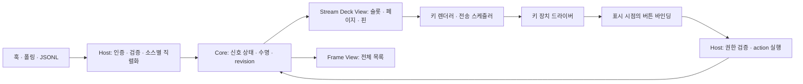

# 로컬 신호 버스 → 스트림덱 설계 v4

상태: 구현 전 검토안 · 2026-09-08

v3의 목표를 유지하되, 상태의 소유권과 장치의 표시 정책을 분리한다.

> **코어는 소스의 제품명을 모른다.**
> **버스는 신호의 상태까지, 슬롯과 페이지는 뷰의 일이다.**

두 번째 문장은 의도적으로 바꾼다. 슬롯의 개수·경쟁·스필오버는 장치의 공간 제약에서 생긴다. 이것을 버스에 넣으면 15키 스트림덱에서 밀려난 신호가 넓은 액자에서도 사라진다.

## 1. v3에서 먼저 고칠 것

| v3의 문제 | v4의 결정 |
|---|---|
| 코어는 페이지를 모르지만 페이지별 슬롯 경쟁과 `claude:2` 생성을 담당 | 코어는 신호 저장소. 슬롯 배정·페이지·핀은 Stream Deck 뷰가 담당 |
| 첫 매치 라우팅 뒤에 urgent 핀 규칙이 있음 | 페이지 선택과 핀 선택을 별도 정책으로 평가 |
| `id`가 전역인지 소스별인지 불명확 | 키는 `(source, id)`. `source`는 호스트가 인증된 소유자로 결정 |
| Adapter는 emit만 받지만 철회·스냅샷도 해야 함 | 단일 `publish(message)`에 upsert/remove/membership을 명시 |
| `kind`가 신호 종류와 프로세스 실행 방식을 동시에 뜻함 | `driver`와 신호의 `kind`를 분리 |
| 스냅샷 실패가 빈 목록으로 해석되면 전체 세션 삭제 | 완전히 성공한 스냅샷만 적용. 실패는 stale 상태로 표현 |
| 오래된 스냅샷이 새 push를 삭제하거나 urgent를 info로 덮어씀 | 존재 여부와 표시 상태 분리, 수집 중 변경 보호 |
| 등록된 action이면 모든 소스가 실행할 수 있음 | 등록 여부 외에 소스별 호출 권한과 대상 범위를 확인 |
| urgent 이동은 금지하면서 30초 후 페이지 자동 복귀 | 기본값은 자동 복귀 없음 |
| 액자도 keys/keySize 인터페이스를 구현해야 함 | 범용 신호 구독과 키 장치 출력 인터페이스를 분리 |
| 버튼의 press가 필수이고 ack가 모든 kind에 가능 | press는 선택. ack는 event에만 허용 |
| focus에 필요한 action 레지스트리가 2단계 | 최소 레지스트리와 실행 검증은 첫 단계 |

## 2. 선택지와 선택 이유

1. **신호 저장소 + 장치별 뷰 — 권장.** 저장소가 수명과 일관성을 보장하고, 뷰가 표시 위치를 유지한다. 같은 신호를 장치마다 다르게 보여줄 수 있다.
2. **버스에 논리 슬롯/채널 유지.** 기존 설명을 덜 바꾸지만 채널 용량과 장치 용량의 대응 규칙이 추가된다. 현재 요구에는 이 중간 계층의 이득이 작다.
3. **Stream Deck 전용 앱부터 만들기.** 첫 결과는 가장 빠르다. 다만 두 소스 통합과 다른 출력 장치가 목적에 이미 포함되어 있어, 신호 저장소와 키 출력 사이의 분리는 지금 해둘 가치가 있다.

1을 선택하되 플러그인 발견·핫 리로드·범용 렌더러는 먼저 만들지 않는다. 처음에는 호스트가 직접 구성하고 실제 두 번째 사용처가 생길 때 설정으로 꺼낸다.

## 3. 구조와 책임



| 모듈 | 숨기는 복잡성 | 외부 인터페이스 |
|---|---|---|
| core | 수명, 중복 제거, revision, 스냅샷 반영, ack | 검증된 명령 적용, 현재 상태 읽기, 변경 구독 |
| host | 인증, 입력 검증, 프로세스 관리, 저장, action 실행 | 로컬 입력 endpoint, 소스 실행 환경 |
| streamdeck-view | 안정적인 슬롯, 페이지, 핀, 요약 | 신호 상태 → 키 표시 계획, 입력 → 의미 있는 요청 |
| key-renderer | 이미지 생성, 캐시 상한, 전송 빈도 | 표시 계획 → 드라이버 쓰기 |
| streamdeck-driver | HID/SDK 연결, 장치 오류와 재연결 | 키 이미지 쓰기, down/up 이벤트 |
| contrib | 제품별 이벤트 해석과 대상 식별 | 신호 발행, 등록된 제품별 action |

호스트가 조립 지점이다. core는 파일·네트워크·프로세스·장치에 접근하지 않는다. core 테스트에는 시계와 저장된 상태를 입력할 수 있다.

```text
packages/
  core/
  host/
  streamdeck/       # 처음에는 view/renderer/driver를 내부 모듈로 유지
contrib/
docs/design/
```

Frame과 선언 로더는 실제 구현 시 추가한다. 디렉터리마다 배포 패키지를 만들 필요는 없다.

## 4. 신호 계약

아래 TypeScript는 계약을 설명하는 설계 표기다. 외부 JSON은 별도 런타임 스키마로 검증한다.

```ts
type Level = "info" | "warn" | "urgent";
type Key = { source: string; id: string };
type Effect =
  | { type: "open"; url: string }
  | { type: "action"; name: string; args: Record<string, string> };

type Common = {
  id: string;
  level: Level;
  label: string;
  detail?: string;
};

type SignalInput = Common & (
  | { kind: "event"; ttlMs?: number; press?: Effect | { type: "ack" } }
  | { kind: "gauge"; value: string; press?: Effect }
  | { kind: "live"; press?: Effect }
);

type SourceMessage =
  | { op: "upsert"; signal: SignalInput; deliveryId: string }
  | { op: "remove"; id: string; deliveryId: string }
  | {
      op: "membership";
      snapshotId: string;
      ids: string[];
      discoveries: Array<Extract<SignalInput, { kind: "live" }>>;
    };
```

- `source`는 payload에서 신뢰하지 않는다. 호스트의 등록과 인증이 결정한다.
- `id`는 소스 안에서 유일하다. 제품 간 동일한 session id는 충돌하지 않는다.
- 같은 키의 `kind` 변경은 거부한다. 종류가 바뀌면 별도 id를 사용한다.
- `upsert`는 해당 신호 표시 내용의 전체 교체다. 생략 필드는 이전 값이 남지 않는다.
- 같은 `deliveryId` 재전송은 no-op이다. 같은 id의 새 delivery는 갱신이다.
- 소스는 동일 개체의 갱신을 발생 순서대로 발행한다. 호스트는 수신 순서로 직렬화한다. 역순 네트워크 전달 자체를 알아내지는 못한다. 순서가 필요한 adapter는 자신의 큐에서 직렬 전송한다.
- 반복 폴링은 알림 횟수가 아니다. 모든 갱신에 카운터를 올리지 않는다. 중복 발생 횟수가 필요하면 event용 명시 필드를 나중에 추가한다.
- `level`은 주의도다. 작업 중/입력 대기/종료 같은 제품 상태의 완전한 표현으로 쓰지 않는다. 첫 버전은 label/detail로 표현하고, 여러 소스가 공통 상태를 요구하면 별도 필드를 도입한다.

저장 레코드는 `key`, `revision`, `createdAt`, `updatedAt`, `expiresAt`, `freshness`를 포함한다. revision은 호스트 수락 순서를 나타내는 단조 증가값이다. 클라이언트 시각을 정렬이나 TTL의 권위로 사용하지 않는다.

freshness는 값의 오래됨만으로 계산하지 않는다. 유휴 세션은 오랫동안 훅이 없어도 정상일 수 있다. 소스 연결/수집 건강도, 개체 존재 확인, 제품 상태의 확인 시각을 구분해 보관한다. 수집 실패 시 즉시 degraded를 표시하고 마지막 성공으로부터 `max(3 × interval, 60초)`가 지나면 해당 소스의 확인 불가능한 표시를 stale로 바꾼다. 정상 membership은 존재 확인만 갱신하며, 재시작 후 남은 urgent 같은 제품 상태를 fresh로 승격시키지 않는다. 제품 상태를 조회할 수 없는 adapter는 이를 미확인으로 표시한다.

### 수명

| 종류 | 갱신 | 제거 | 소스 장애 |
|---|---|---|---|
| event | 같은 키를 교체하되 최초 만료 시각 유지 | ack, TTL, 소유자의 remove | 기존 event는 TTL/ack 규칙 유지 |
| gauge | 고정된 등록 id의 값 교체 | 설정 제거 또는 소유자의 명시 remove | 마지막 값 + stale 표시 |
| live | 같은 개체의 상태 교체 | 소유자 remove 또는 성공한 membership 교정 | 마지막 상태 + stale 표시 |

event의 새 발생은 새 id를 사용한다. 열린 event를 재전송해서 TTL이 무한 연장되지 않는다. 같은 키의 event가 이미 종료됐다면 중복 재생 방지 기간 동안 되살리지 않는다.

`ack`는 event를 없애는 사용자 의도다. open/action 성공을 ack로 간주하지 않는다. event에 open/action을 지정한 경우 첫 버전에서는 TTL 또는 별도 관리 화면의 ack로 종료한다. 둘을 한 번에 하는 복합 press는 초기 범위에서 제외한다.

## 5. push와 스냅샷: 존재와 상태를 나눈다

세션 훅은 빠른 상태 변경을 알려주고, 목록 수집기는 존재 여부를 확인한다. **목록에 있다는 이유만으로 urgent를 info로 덮어쓰지 않는다.**

한 source에 하나의 소유자가 있다. 훅과 목록 수집기는 그 소유자가 제공하는 두 입력 경로다. 관련 없는 소스가 다른 소스의 목록을 삭제할 수 없다. membership 발행 권한은 등록된 수집기에만 준다.

초기 membership은 live에만 적용한다. 열린 PR, 컨테이너 등도 live로 표현할 수 있다. 전체 값 교체형 gauge/event 스냅샷은 필요할 때 별도 계약으로 추가한다.

### 성공과 실패

- 완전한 수집만 성공이다. 프로세스 exit 0, 전체 출력 수신, JSON/schema 검증, 모든 페이지 수집이 끝나야 반영한다.
- 성공한 빈 목록은 “현재 없음”이다. timeout, 비정상 종료, 잘린 JSON, 일부 페이지 실패는 “모름”이다.
- 실패하면 삭제 diff를 적용하지 않고 소스 상태를 degraded로 바꾼다.
- 빠진 개체는 **연속 두 번 성공한 수집에서 누락**되어야 자동 철회한다. 중간 실패는 누락 연속 횟수를 초기화한다.
- 20초 주기는 철회 시간의 보장이 아니다. 정상 수집이 계속될 때도 두 번 누락 확인에 대략 20–40초와 수집 시간이 필요하고, 장애 중에는 상한이 없다.

### 수집 중 변경

1. 호스트가 수집을 시작하며 해당 source의 현재 revision을 watermark로 기록한다. watermark는 클라이언트가 지정하지 않는다.
2. 동일 source의 스냅샷 수집은 겹치지 않는다. 각 실행에는 호스트 발급 snapshotId가 있다.
3. 수집 중에도 push는 수락한다.
4. 목록 반영 시 watermark 이후 upsert된 키는 이번 누락 판정에서 제외하고 누락 횟수를 초기화한다. watermark 이후 remove된 키는 snapshot으로 복구하지 않는다. tombstone도 비교 대상이다.
5. 오래된 snapshotId나 이미 반영한 snapshotId는 거부/무시한다. 검증·diff·반영은 원자적이다.

목록에만 있는 새 id는 자동으로 완성된 Signal이 되지 않는다. adapter가 메타데이터를 조회해 같은 membership의 discoveries에 넣는다. discovery id는 ids의 부분집합이어야 하고 중복은 거부한다. 반영 시에도 존재하지 않는 키만 삽입하며, watermark 이후 remove된 키는 삽입하지 않는다. 이미 존재하는 키의 표시 상태는 discoveries로 덮어쓰지 않는다. 발견·삽입·누락 교정은 한 트랜잭션이다. 상태를 복구할 수 없다면 “상태 미확인” label과 freshness로 표시하고 승인 액션은 주지 않는다.

이 규칙은 수집 도중의 경쟁을 막는다. 수집기 자체가 오래된 캐시를 읽는 문제까지 해결하지는 않는다. 수집기가 어떤 집합을 완전하게 관측하는지 contrib 문서에 적어야 한다. 전체 집합을 보장할 수 없는 수집기는 자동 철회 권한을 받지 않는다.

`ps`에서 프로세스가 보이는 것과 신호의 session id를 정확히 복구할 수 있는 것은 별개의 문제다. PID를 사용한다면 시작 시각까지 묶어 재사용을 구분하고, 실제 세션 식별자는 검증된 adapter 조회에서 얻는다.

## 6. 표시 정책: 슬롯에서 밀려도 신호는 남는다

### 페이지 라우팅과 핀 선택

```toml
[[view.streamdeck.route]]
match = { kind = "live" }
page = "sessions"

[[view.streamdeck.route]]
match = { source = "ci" }
page = "ci"

[[view.streamdeck.route]]
match = {}
page = "alerts"

[view.streamdeck.pin]
match = { level = "urgent" }
```

route는 위에서 첫 매치를 사용한다. pin은 모든 신호에 별도로 평가한다. match 안의 필드는 AND이며 알 수 없는 필드는 설정 오류다. 초기 코드는 같은 정책을 함수로 구현해도 된다.

변동하는 level을 페이지 선택 조건으로 사용하는 것은 권장하지 않는다. 첫 버전의 페이지 소속은 최초 배정 때 고정하고, 해당 신호의 수명이 끝날 때 해제한다. level 변화는 색과 핀에만 반영한다. 설정 변경에 따른 재배치는 명시적 재로드 시 적용하며 뷰 바인딩을 무효화한다.

### 종류별 정책

- **live:** 최초 배정한 위치를 유지한다. 12개를 넘으면 같은 논리 페이지의 다음 화면을 만든다. 가운데 빈칸을 채우려고 기존 항목을 이동하지 않는다. 비어 있는 마지막 화면만 제거하고 현재 보고 있는 화면은 탐색으로 떠날 때까지 유지한다.
- **event:** 빈 슬롯의 후보는 주의도 내림차순(urgent > warn > info), createdAt 오름차순으로 선택하고, 슬롯은 낮은 인덱스부터 사용한다. 기존 항목은 정렬을 맞추려고 이동하지 않는다. 숨겨진 후보의 level이 표시된 최저 level보다 높을 때만 선점한다. 피선점 대상은 최저 level 중 displayedSince가 가장 오래된 항목이다. 동률은 key의 사전순으로 결정한다. 신규 입력·level 갱신·제거 때 이 규칙을 재평가한다. 숨겨진 event는 저장소에 남고 자리가 나면 다시 후보가 된다.
- **gauge:** 뷰 설정에서 id와 위치를 예약한다. 설정 용량 초과는 시작 시 오류다. 아직 값이 없으면 “데이터 없음”, 실패하면 마지막 값에 stale을 표시한다.

초기 뷰에서는 한 논리 페이지에 한 kind만 배치한다. 설정 검증으로 강제한다. 따라서 event가 live/gauge를 밀어낼 수 없다. 혼합 페이지와 영역 분할은 초기 범위에서 제외한다.

event overflow는 현재 표시되지 않은 활성 event 수다. 데이터 유실 수가 아니다. 저장소가 자원 한도로 입력을 거부한 수는 별도 운영 지표다.

### 핀

- 핀은 원본 신호의 별도 표시다. 복제 event를 만들지 않고 같은 key/revision을 가리킨다.
- 여러 urgent 중 최초 선택한 항목을 유지한다. 그 항목이 urgent가 아니거나 제거됐을 때 가장 오래 기다린 urgent로 넘어간다. 회전 애니메이션으로 대상을 바꾸지 않는다.
- 숨겨진 urgent 개수는 `+N`으로 표시한다. 핀을 누르면 원본 페이지로 이동하고 대상을 강조한다. action/승인을 직접 실행하지 않는다.
- urgent가 없으면 비활성 상태다. 핀 전용 urgent 자동 페이지 전환은 없다.

### 탐색과 요약

15키는 0-based 인덱스 10=이전, 13=핀, 14=다음, 나머지 12개=내용으로 고정한다. 첫 버전도 이 배치를 예약해 페이징 추가 후 기존 세션 위치가 바뀌지 않게 한다.

탐색은 순환하지 않고 양 끝에서 멈춘다. 왼쪽 요약은 현재 화면보다 앞의 모든 화면, 오른쪽 요약은 뒤의 모든 화면을 집계한다. 이렇게 해야 양쪽 숫자가 같은 신호를 중복 계산하지 않는다.

요약은 `E: 미확인 event 수`, `!: urgent live/gauge 수`, 그리고 전체 대상의 최고 주의도를 표시한다. “빨간 2”만으로 urgent 두 개인지 전체 두 개인지 추측하게 하지 않는다. 정적 gauge의 info 값은 알림 수에 더하지 않는다. 핀 복제본은 세지 않고, 숨겨진 event는 포함한다.

현재 화면의 overflow는 다음 버튼의 별도 작은 `+N` 표기로 표시한다. 페이지 번호는 `2/4`처럼 next 키의 고정 영역에 둔다. 작은 화면에서 이 정보가 읽히는지는 실기기로 확인하며, 읽히지 않으면 색/숫자를 더 넣기보다 보조 정보를 관리 화면으로 옮긴다.

자동 복귀는 기본적으로 끈다. 이후 옵션을 넣더라도 키를 누르는 동안에는 동작하지 않고 페이지 변경 후 다시 누르기 전까지 액션을 실행하지 않는다.

## 7. 입력: 누른 그림과 실행할 대상이 같아야 한다

물리 index만 받아서 현재 슬롯을 조회하면, press 처리 직전에 화면이 갱신됐을 때 다른 대상이 실행될 수 있다.

- 렌더러는 성공적으로 전송한 키별 바인딩 `(viewEpoch, index, key, revision)`을 보관한다.
- key-down에서 바인딩을 고정한다. key-up에서 같은 바인딩인지 확인하고 한 번만 실행한다.
- 해당 키가 전송 중이거나 페이지가 바뀌었거나 신호 revision이 달라졌다면 실행하지 않는다. 변경된 상태를 보고 다시 누르게 한다.
- 페이지 전환은 여러 키의 비원자적 쓰기일 수 있다. 전환 시작부터 전체 전송 완료와 기존 눌림 해제까지 입력을 비활성화한다.
- 연결이 끊겼다 다시 붙으면 전체 화면을 다시 쓰고, 눌린 키가 모두 해제되기 전까지 입력을 받지 않는다.

driver의 전송 성공은 사람이 새 그림을 봤다는 증명이 아니다. 일반 focus/open은 위 방식을 사용하되 **승인·거절 등 결과가 큰 action은 첫 버전에서 제외**한다. 이를 추가하려면 외부 도구의 gate가 여전히 pending인지 재검증하고 별도 확인 절차를 설계해야 한다. `orca:decide` 등록만으로 안전한 승인이 완성되지는 않는다.

## 8. 로컬 입력과 액션 권한

첫 전송은 loopback HTTP로 단순화한다. 원격 접속은 초기 범위가 아니다.

```text
POST   /v1/sources/{source}/signals       upsert + deliveryId
DELETE /v1/sources/{source}/signals/{id}  remove + deliveryId
GET    /v1/state                         관리 화면용 읽기
POST   /v1/ack                           관리자 토큰 + key/revision
```

membership은 처음에는 호스트가 실행하는 수집기 내부 인터페이스만 사용한다. URL id는 경로용 인코딩을 적용하고 길이를 제한한다.

ack는 source의 remove와 별도 사용자 명령이다. B 단계의 관리 CLI/화면이 관리자 인증으로 호출한다. revision이 달라졌으면 충돌을 반환하고 최신 내용을 다시 확인하게 한다. 장치의 ack press도 동일한 core 명령을 사용한다.

- loopback bind, source별 토큰, source별 쓰기 범위 검증을 함께 사용한다. localhost라는 이유만으로 인증을 생략하지 않는다.
- 브라우저 Origin 요청은 기본 거부하고 CORS를 열지 않는다. push 입력은 지정한 JSON content type만 받는다.
- 요청 크기, 문자열 길이, signal 수, 출력 크기, 실행 시간에 상한을 둔다. 초기 권장값은 요청/스냅샷 1 MiB, source당 활성 신호 1,000개, id 128자, label 80자다.
- 저장소 한도를 넘으면 명시적으로 거부한다. 기존 live를 조용히 삭제하지 않는다. 한도 오류를 소스 상태와 관리 로그에 노출한다.
- 훅 클라이언트는 짧은 timeout으로 전송하고 실패해도 원래 도구 흐름을 막지 않는다. 훅별 응답 프로토콜을 훼손하지 않도록 진단은 stderr에만 기록한다.

action 등록은 다음 세 조건을 모두 만족해야 실행된다.

1. action 이름이 호스트 설정에 등록되어 있다.
2. 해당 신호 source가 그 action을 호출할 권한을 갖는다.
3. 인자 스키마와 대상 소유권 검증을 통과한다.

argv 배열과 `shell: false`는 셸 확장을 막는다. 호출 프로그램이 옵션/경로/대상 문자열을 위험하게 해석하는 문제까지 막지는 못한다. 템플릿은 각 인자가 별도 argv 원소가 되게 하며 임의 옵션명 치환은 허용하지 않는다. 가능하면 CLI가 지원하는 `--` 또는 명확한 값 옵션을 사용한다.

정규식은 로컬 신뢰 설정이며 길이 상한과 함께 사용한다. 외부 payload가 정규식이나 실행 파일 경로를 제공할 수 없다. 등록된 실행 파일, 고정 작업 디렉터리, 필요한 환경변수만 전달한다. timeout 및 출력 상한을 적용하고 같은 대상의 중복 실행을 막는다. action 실패는 신호를 자동 ack하지 않는다.

`open`은 URL parser로 https scheme과 source별 허용 host를 검증한다. TS 템플릿 문자열 타입은 외부 입력 보안 검증을 대신하지 않는다.

JSONL/TS adapter와 exec 선언은 사용자가 설치하는 로컬 신뢰 코드다. 이 설계는 adapter sandbox를 제공하지 않는다. 핵심은 외부 데이터가 신뢰 코드의 실행 권한을 임의로 고르지 못하게 하는 것이다.

## 9. 선언과 실행 방식

`driver`는 입력 방식이고 `kind`는 신호의 수명이다. 둘을 같은 필드에 넣지 않는다.

```toml
[[source]]
name = "gha-queue"
driver = "poll-exec"
interval = "60s"
timeout = "5s"
exec = ["gh", "api", "repos/cookieplace/crepe/actions/runs?status=queued"]

[source.map]
kind = '"gauge"'
id = '"queue"'
label = '"queue"'
value = '.total_count | tostring'
level = 'if .total_count > 5 then "warn" else "info" end'

[[source]]
name = "doorbell"
driver = "jsonl-exec"
exec = ["/absolute/path/doorbell-watch"]
```

선언 로더는 2단계에서 구현한다.

폴링 실행은 같은 source에서 겹치지 않고, 이전 실행 중이면 다음 tick을 건너뛴다. JSONL은 행 크기와 출력 속도를 제한하고, 잘못된 행은 상태를 변경하지 않고 진단한다. 프로세스 재시작은 상한 있는 exponential backoff와 jitter를 사용하고, 정상 가동이 일정 시간 지속된 뒤 backoff를 초기화한다.

jq 평가에도 timeout과 출력 상한을 적용하고 map 결과 전체를 검증한 뒤 반영한다. `~`는 셸 없이 자동 확장되지 않으므로 초기 버전은 절대 경로나 PATH에서 찾을 수 있는 실행 이름을 요구한다.

설정 재로드는 parse → validate → atomic swap 순서다. 실패하면 기존 설정을 유지한다. 핫 리로드는 초기 범위에서 제외한다.

## 10. 저장과 재시작

첫 버전부터 작은 영속 저장소에 수락된 신호와 tombstone을 저장한다. 구현 후보는 SQLite이며 구체 라이브러리는 구현 시 선택한다.

- upsert/remove/ack, membership의 발견·자동 철회, TTL 만료가 모두 같은 영속 반영 경로를 사용한다. 각 명령의 상태 변경·tombstone·revision·중복 기록을 한 트랜잭션으로 반영한 뒤에만 성공 응답과 구독자 알림을 내보낸다.
- 재시작 시 미완료 snapshot은 폐기하고 누락 횟수는 0으로 초기화한다. 복구 직후 오래된 누락 횟수로 live를 제거하지 않는다.
- delivery 중복 기록과 종료된 event 키는 24시간 보관한다. 클라이언트 재시도 보장도 24시간 이내로 제한한다. 보관량 상한에 도달하면 보장 창을 몰래 줄이지 않고 새 입력을 거부한다.
- TTL은 최초 수락 시 expiresAt을 계산해 저장한다. 실행 중 경과는 단조 시계로 추적하고, 재시작 시에는 저장된 절대 시각으로 만료를 계산한다. OS 시각이 크게 바뀌면 재시작 전후 만료 시점에 오차가 날 수 있다.
- 재시작 시 만료 event를 제거하고 live/gauge는 stale로 시작한다. live의 목록 확인만으로 이전 작업 상태를 fresh로 바꾸지 않는다.
- 슬롯 매핑도 장치별로 보존한다. 이벤트 로그가 아니라 현재 배치만 저장한다. 장치 모델/키 배치가 바뀌면 새 layout revision으로 초기화한다.
- 외부 action의 exactly-once는 보장하지 않는다. 실행 중 crash로 결과가 불명확하면 unknown으로 기록하고 자동 재실행하지 않는다.

무기한 event는 저장 공간을 무기한 쓴다. 소스별 한도와 관리 화면의 ack가 있어야 한다. “TTL이 없으면 영원히 안전하게 보관”이라는 무제한 보장은 하지 않는다.

## 11. 렌더링과 연결 장애

범용 Transport에 키 수를 강제하지 않는다. 아래는 키 장치 전용 인터페이스다.

```ts
type KeyDevice = {
  capabilities: {
    keyCount: number;
    pixelWidth: number;
    pixelHeight: number;
    preferredMaxFps: number;
  };
  write(batch: KeyImage[], signal: AbortSignal): Promise<void>;
  standby(): Promise<void>; // Show Logo; 커스텀 스크린세이버 복원은 아님
  close(): Promise<void>;
  onKey(handler: (event: { index: number; edge: "down" | "up" }) => void): void;
};
```

Frame 뷰는 core 구독을 통해 목록을 직접 표시한다. 실제 두 뷰에서 공통점이 입증되기 전에는 출력 장치 통합 인터페이스를 더 넓히지 않는다.

- coalesce는 잦은 변경을 합치는 기능이다. FPS 제한은 별도의 시각 기반 스케줄러가 담당한다.
- 동시에 진행 중인 write는 하나로 제한하고, pending은 가장 최신 표시 계획 하나만 유지한다. write 완료와 최소 전송 간격을 둘 다 만족할 때 다음 쓰기를 시작한다.
- HID/SDK에 각각 30/10 FPS를 규격처럼 고정하지 않는다. 모델·화상 크기·전송 구현에 따라 측정해 driver 설정값을 정한다.
- 첫 버전은 정적 색상과 텍스트만 렌더링한다. 애니메이션은 실제 가독성 개선이 확인된 뒤 추가한다.
- 캐시 키는 label뿐 아니라 value/level/freshness/theme/해상도를 포함한다. 바이트 상한을 둔 LRU를 사용한다. 고빈도 gauge의 전체 애니메이션 시퀀스를 무제한 합성하지 않는다.
- 연결 장애는 수집을 멈추지 않는다. 재연결 후 최신 화면 전체를 전송한다. 느린 장치 때문에 core 상태가 뒤처지지 않는다.

### 디스플레이 수명 관리

호스트는 OS의 화면 잠금·세션 비활성·잠자기를 관찰하고, 드라이버 수명 관리자는 출력과 연결을 직렬화한다. 코어는 화면이 잠겨도 신호 수집과 저장을 계속한다.

- 종료·잠금·잠자기: 입력 차단 → 대기 프레임 폐기/진행 프레임 중단 요청 → 현재 HID 쓰기 종료 → Show Logo → HID 닫기.
- 재활성화: OS 상태 확인 → 연결 → 최신 전체 화면 전송 → 기존 눌림 해제 확인 → 입력 허용.
- 연결 오류: 이전 핸들과 입력 바인딩을 폐기하고 재접속 시 전체 화면을 쓴다. 늦게 도착한 이전 핸들 이벤트를 무시한다.
- 모니터 상태가 불명확하거나 heartbeat가 6초 끊기면 비활성으로 처리한다. 기기 출력 오류는 신호 저장을 멈추지 않는다.
- 중복 종료는 한 번만 처리하고 종료 이후 늦은 resume가 장치를 다시 열지 못한다.
- USB 분리·SIGKILL·전원 차단 시 즉시 복귀는 보장하지 않는다. OS가 USB 전원을 중단하기 전의 잠자기 정리는 best effort다. timeout된 핸들은 재사용하지 않고 재연결/수동 복구로 처리한다.

현재 구현은 macOS native helper를 사용하고 잠금 관련 비공개 알림 의존성을 문서화한다. OS 업데이트 시 실기기 검증한다. 자세한 구현 범위는 [디스플레이 수명 관리](display-lifecycle-plan.md)에 기록한다.

## 12. 구현 순서와 완료 조건

### A. 매일 사용하는 세션 보드

포함: live 계약, 로컬 인증 push, 영속 상태, 검증된 한 세션 adapter, membership 교정, focus action, 정적 렌더링, 12개 초과 세션 화면, 입력 바인딩 보호.

event/gauge 타입은 문서에 유지하되 A의 런타임에서는 live만 수락한다. 페이징은 한 종류의 스필오버에 필요한 최소 기능만 구현한다. 처음부터 “13번째 세션은 보이지 않음”을 남기지 않는다.

완료 조건: 정상 시작/종료, 강제 종료, 데몬 재시작, 장치 재연결, 13개 이상 세션을 시연할 수 있다. 잘못된 대상에 focus하지 않으며, 존재를 확인할 수 없을 때 stale임을 사용자가 볼 수 있다.

### B. 두 번째 소스와 알림

포함: 두 번째 세션 adapter, event/ack/TTL, gauge 고정 배치, alerts/ci 페이지, 핀과 요약, 선언 poll-exec와 jq.

완료 조건: 동일 id를 쓰는 두 source가 공존하고, event 폭주가 live 위치를 바꾸지 않는다. 두 번째 adapter를 추가할 때 core를 수정하지 않는다.

### C. 확장 필요가 확인된 것

포함 후보: JSONL 프로세스 관리, Frame 뷰, 설정 재로드, 애니메이션, TS adapter 로딩, 승인 액션.

각 항목은 실제 사용 사례가 있을 때 진행한다. 제품별 focus CLI와 세션 목록 조회가 검증되지 않으면 해당 adapter를 완료로 표시하지 않는다.

## 13. 구현 검증 시나리오

| 입력/상황 | 기대 결과 |
|---|---|
| A/id1과 B/id1 upsert | 별개 신호 두 개 |
| 같은 deliveryId 재전송 | revision/TTL/횟수 변화 없음 |
| live에 ack 또는 ttlMs 전달 | 입력 거부 |
| snapshot 수집 중 새로운 live upsert | 오래된 목록으로 제거하지 않음 |
| snapshot 수집 중 remove 후 오래된 목록 도착 | 부활하지 않음 |
| urgent live가 membership 목록에 존재 | urgent 유지, 상태 freshness는 별도 |
| 수집 timeout 또는 부분 JSON | 삭제 없음, degraded 표시 |
| 성공한 빈 목록 두 번 | 해당 소스 live만 철회 |
| 13번째 live | 두 번째 화면에 표시, 앞의 12개 위치 유지 |
| event 표시 교체 | 원본 저장소와 Frame용 조회에는 유지 |
| live urgent가 첫 route에 매치 | 원래 페이지와 핀에 함께 표시 |
| 키 down과 up 사이 대상 갱신/페이지 전환 | action 실행 없음 |
| 등록된 action을 권한 없는 source가 지정 | 수락/실행 시 검증으로 차단 |
| write가 업데이트 속도보다 느림 | pending 하나, 동시 write 하나, FPS 상한 유지 |
| daemon crash 후 복구 | durable event 유지, live/gauge stale, action 자동 재실행 없음 |
| contrib 디렉터리 없이 core 빌드 | 성공 |

## 14. 외부 연동 검증 결과

2026-09-08에 공식 문서 기준으로 확인했다. 변경될 수 있는 제품 계약이므로 adapter 구현 시 설치 버전에서 다시 검증한다.

| v3의 전제 | 확인 결과 |
|---|---|
| SessionStart는 세션당 한 번이며 source에 fork가 있음 | 공식 source 값은 startup/resume/clear/compact. 반복 발화에 안전한 upsert가 필요 |
| Stop으로 작업 종료 상태를 처리 | 응답 종료이며 세션 종료가 아님. 사용자 인터럽트에서는 실행되지 않고 API 실패는 StopFailure 경로도 있음 |
| PermissionRequest로 urgent 설정 | 대화상자 직전 발화는 확인. 이후 도구 실행·실패·거절 경로를 함께 처리해야 urgent가 고착되지 않음 |
| SessionEnd는 설정 timeout을 따름 | 현재 기본 예산 1.5초. settings의 per-hook timeout과 plugin hook timeout의 취급이 다르므로 단순화 금지 |

근거: [Claude Code hooks reference](https://code.claude.com/docs/en/hooks), [공식 changelog](https://raw.githubusercontent.com/anthropics/claude-code/main/CHANGELOG.md).

`--session-id`는 필수가 아니며 일반 시작, `--continue`, ID 없는 `--resume`도 지원된다. 따라서 `ps` argv만으로 완전한 세션 목록을 복원할 수 없다는 판단은 공식 호출 방식에 근거한 추론이다. [CLI reference](https://code.claude.com/docs/en/cli-reference)

`cmux focus --session`은 확인한 공식 CLI 계약에 없다. `cmux sessions list`는 저장된 세션 기록을 포함하므로 생존 목록으로 바로 사용할 수 없다. session id → 현재 workspace/surface 해석과 생존 확인은 contrib adapter가 담당해야 한다. 제품별 좌표를 core에 넣지 않는 원칙은 그대로 유지한다. [cmux CLI contract](https://github.com/manaflow-ai/cmux/blob/main/docs/cli-contract.md)

HID 30 FPS와 SDK 10 FPS를 고정 보장하는 공식 근거는 확인하지 못했다. driver별 실측 전송 예산으로 취급한다. [Elgato HID 문서](https://docs.elgato.com/streamdeck/hid/intro/), [SDK 이미지 API](https://docs.elgato.com/streamdeck/sdk/guides/keys/)

첫 세션 adapter의 상태 전이는 아래를 기준으로 실제 훅 trace와 대조한다. 제품의 상태 명칭은 contrib 안에 둔다.

- SessionStart: 같은 id upsert, 복구된 상태가 없으면 미확인/유휴로 표시.
- UserPromptSubmit: 작업 중으로 변경.
- PermissionRequest: 권한 대기로 변경, urgent.
- PostToolUse/PostToolUseFailure: 해당 권한 대기가 해소된 실행인지 확인한 뒤 작업 중/실패 표시. 요청 상관관계가 없으면 다른 대기를 무조건 해제하지 않음.
- Stop/StopFailure: 턴 종료/오류로 변경. live는 유지.
- 거절/인터럽트로 후속 훅이 없는 경우: 임의로 승인 완료로 추정하지 않음. 대기 표시의 freshness를 낮추고, 확인 가능한 제품 조회나 다음 유효 이벤트로 교정.
- SessionEnd: remove. 누락은 membership으로 교정.

## 15. 남은 제품 결정

기본 가정은 15키 장치, 단일 Mac, 개인 사용, 첫 액션은 focus다. 물리 장치 모델과 첫 adapter(cmux 또는 Orca)는 구현 시작 시 실제 환경에서 선택한다.

설계의 성공 기준은 플러그인 종류 수가 아니다. **소스를 추가해도 코어를 수정하지 않고, 상태가 불확실할 때 이를 숨기지 않으며, 버튼을 눌렀을 때 예상한 대상이 선택되는 것**이다.
